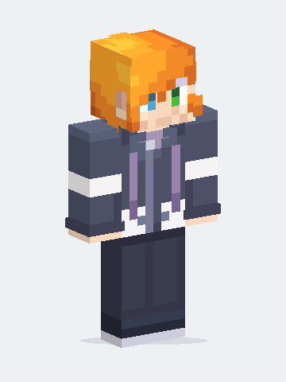

# Minecraft Skin Maker

Turn an image, a text description, or both into a Minecraft player skin. Your AI agent handles the pixel art, previews and export.

## Install

```sh
npx skills add BLCNYY/minecraft-skin-maker --skill minecraft-skin-maker
```

Choose Codex, Claude Code, Cursor or another supported agent when prompted. You'll need Node.js and npm for this installer.

## Use it

Attach a reference image and ask:

> Use the minecraft-skin-maker skill to turn this character into a Minecraft skin.

Or describe a character:

> Use the minecraft-skin-maker skill to make a forest explorer with curly hair, a green jacket and a red scarf.

You get a **64×64 skin PNG**, previews, an editable design and a **Bedrock pack**. Use the PNG for Java Edition or the pack for Bedrock. [How to import your skin →](skills/minecraft-skin-maker/references/formats-and-import.md)

## OG example

<table>
  <tr>
    <th align="center">Reference</th>
    <th align="center">Result</th>
  </tr>
  <tr>
    <td align="center"></td>
    <td align="center"></td>
  </tr>
</table>

[Skin PNG](examples/og/skin.png) · [Bedrock pack](examples/og/skin.mcpack) · [More previews](examples/og/preview.png)

## More details

- [Technical guide](docs/technical-guide.md): other install options, requirements, compatibility, development and limits.
- [Downloads](https://github.com/BLCNYY/minecraft-skin-maker/releases) · [skills.sh listing](https://www.skills.sh/blcnyy/minecraft-skin-maker/minecraft-skin-maker)
- [Report an issue](https://github.com/BLCNYY/minecraft-skin-maker/issues) · [Privacy](PRIVACY.md) · [Terms](TERMS.md)

Code and documentation use the [MIT License](LICENSE). The OG example has [separate artwork terms](examples/og/LICENSE.md).

Created by [BLCNYY](https://github.com/BLCNYY). Independent community project; unaffiliated with Mojang, Microsoft or OpenAI.
