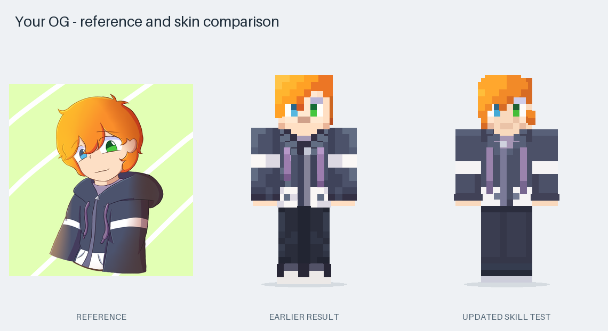

# Minecraft Skin Maker

[](https://github.com/BLCNYY/minecraft-skin-maker/actions/workflows/checks.yml)
[](LICENSE)

A Codex skill that turns an image, a text description, or both into a Minecraft player skin. Attach your character or describe an idea; Codex handles the model, pixel layout, previews and export.

## OG example

The repository owner's original character was used to test the workflow. The comparison shows the reference, the earlier result and the revised skin.



The revised skin keeps the orange fringe, blue and green eyes, lavender hoodie cords and white sleeve bands. It uses smoother fabric shading and selected outer layers for the hair. Plain dark trousers and shoes complete the unseen lower half.

[Front, back and angled preview](examples/og/preview.png) · [Face comparison](examples/og/reference-review.png) · [Skin PNG](examples/og/skin.png) · [Bedrock pack](examples/og/skin.mcpack) · [Editable design](examples/og/design.json)

The character example has [separate artwork terms](examples/og/LICENSE.md).

## Install in Codex

Paste this into Codex:

```text
Use $skill-installer to install https://github.com/BLCNYY/minecraft-skin-maker/tree/main/skills/minecraft-skin-maker
```

After installation, attach an image and send:

```text
Use $minecraft-skin-maker to turn this character into a Minecraft skin.
```

For a description:

```text
Use $minecraft-skin-maker to make a forest explorer with dark curly hair,
a green jacket, a red scarf and brown boots.
```

Codex needs permission to read your reference and run local Python. The helpers use Python 3.10+, Pillow and NumPy; the skill handles dependency setup when needed. Generation uses your Codex session and its normal usage limits. The Python helpers perform local assembly and rendering without a separate image-generation API.

For manual installation, copy the `skills/minecraft-skin-maker` folder into your Codex skills directory, normally `~/.codex/skills/`. The installed skill is available on your next turn.

## What you get

- A **64×64 skin PNG** for Minecraft.
- Front, back and angled **previews rendered from that PNG**.
- A companion **Bedrock `.mcpack`** by default.
- An **editable design** for later changes.
- Import instructions and automated file checks.
- A reference comparison and visual inspection record when using an image.

Technical choices are automatic. You can volunteer preferences such as Slim arms or Java-only export. Revisions can be simple: “Make the hoodie red and keep everything else.”

## Use the exported skin

- **Java:** In the Minecraft Launcher, open Java Edition → Skins → New Skin. Choose the exported PNG and the model named in its import notes. The OG example uses **Classic/Wide**.
- **Bedrock on Windows or mobile:** Open the `.mcpack` with Minecraft and choose the imported skin under Dressing Room → Classic Skins. The generated import notes include a PNG fallback.
- **Consoles:** Xbox, PlayStation and Switch do not officially support importing arbitrary custom skin files.

See [format and import references](skills/minecraft-skin-maker/references/formats-and-import.md) for sources and platform details.

## How it works

1. Codex reads the reference or description and records identifying features and any assumptions.
2. It writes an editable design with named colors and components for the face, hair and clothing.
3. Python assembles the skin, validates its texture layout and builds previews and a Bedrock pack.
4. Codex compares the previews with the reference, corrects visible mismatches and inspects the final export.

Image interpretation and creative design happen in Codex. The Python tools assemble a supplied design deterministically. Given the same design, the skin PNG is reproducible; Bedrock pack identifiers are regenerated for each build.

## Development

From a clone of this repository, install the helper dependencies:

```sh
python -m pip install -r skills/minecraft-skin-maker/requirements.txt
```

Build the included OG example:

```sh
python skills/minecraft-skin-maker/scripts/skinmaker.py build examples/og/design.json --reference examples/og/reference.png --out work/og
```

Run the checks:

```sh
python skills/minecraft-skin-maker/scripts/selftest.py --out work/checks
```

The suite has 28 checks covering Classic/Slim texture layouts, face orientation, transparency, imports, revisions, preview sources and Bedrock packages. CI also rebuilds the OG example and checks that its PNG matches the committed skin.

More detail: [skill workflow](skills/minecraft-skin-maker/SKILL.md), [design format](skills/minecraft-skin-maker/references/design-format.md), [likeness review](skills/minecraft-skin-maker/references/likeness-and-pixel-art.md).

## Current limits

This is an early public release. The OG output has passed file checks and visual inspection; an actual in-game import has not been verified. Minecraft's standard block model and small pixel grid simplify curved hairstyles and expressions. Unseen parts of a character require interpretation.

The helper supports standard player skins and outer layers. Custom 3D geometry, functional capes, high-resolution skins and automatic account uploads are outside its scope.

To report a problem, [open an issue](https://github.com/BLCNYY/minecraft-skin-maker/issues) with your prompt, expected result and generated preview. Include a reference image only if you are comfortable sharing it publicly.

## License and credits

Software, documentation and reusable templates are released under the [MIT License](LICENSE). Files under `examples/og/` are excluded and have [separate artwork terms](examples/og/LICENSE.md).

Created by [BLCNYY](https://github.com/BLCNYY). This is an independent community project and is not affiliated with Mojang, Microsoft or OpenAI.
